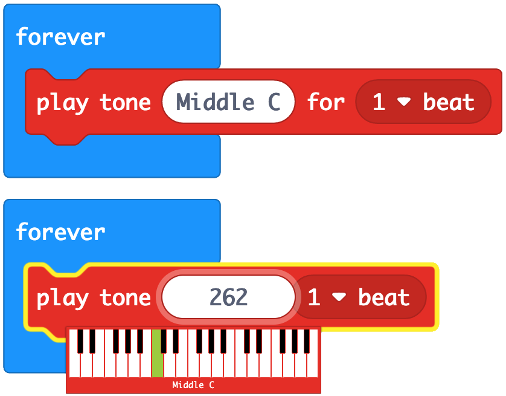

# micro:bit Musical Notes

Musical notes for micro:bit projects.

When using Microsoft MakeCode to program sound for the micro:bit a piano keyboard is presented and musical notes are shown by name. Each note name corresponds to a numerical tone that is played. For instance, Middle C is 262.

Below is a chart showing each musical note and its corresponding tone.

|Note|Tone|
|---|---|
|Low C|131|
|Low C#|139|
|Low D|147|
|Low D#|156|
|Low E|165|
|Low F|175|
|Low F#|185|
|Low G|196|
|Low G#|208|
|Low A|220|
|Low A#|233|
|Low B|247|
|Middle C|262|
|Middle C#|277|
|Middle D|294|
|Middle D#|311|
|Middle E|330|
|Middle F|349|
|Middle F#|370|
|Middle G|392|
|Middle G#|415|
|Middle A|440|
|Middle A#|466|
|Middle B|494|
|High C|523|
|High C#|554|
|High D|587|
|High D#|622|
|High E|659|
|High F|698|
|High F#|740|
|High G|784|
|High G#|831|
|High A|880|
|High A#|932|
|High B|988|

---

